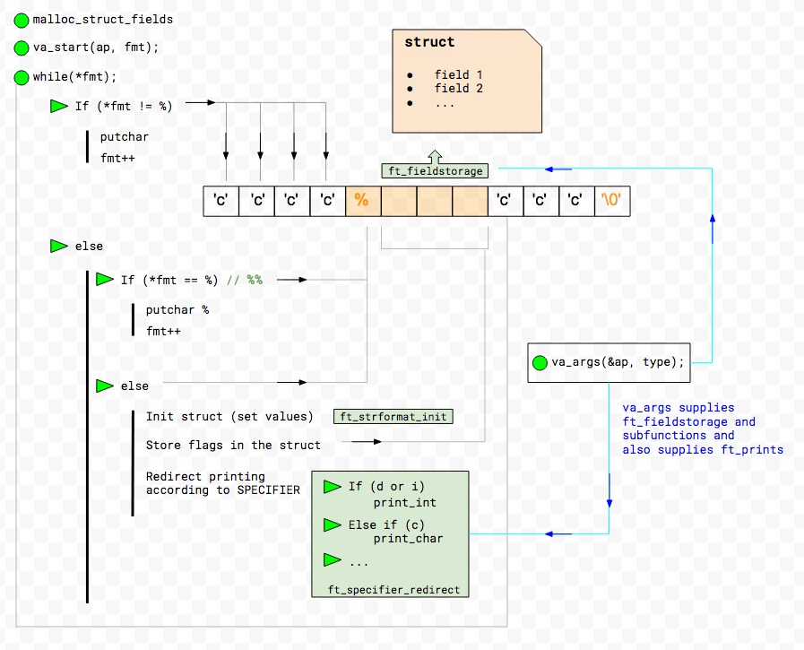
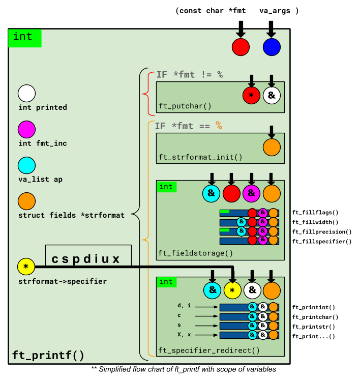

# Printf42
Printf function recoded, with limited specifiers and flags. Because putnbr and putstr aren’t enough!

## Use:

🚧 project:<br/>
```
42Libft $ make
```
🚿 Clean Obj files:<br/>
```
42Libft $ make clean
```
🚿 🚿 Clean All (obj files + binary):<br/>
```
42Libft $ make fclean
```
🚿 🚿 🚧 Clean All + build:<br/>
```
42Libft $ make re
```

<br/>See Makefile<br/>
<h2><b>Logic</b></h2>

Basically, this printf works on demand. It goes through the string and, at each step, prints the character found. (Like a char machine gun - the char found is printed and counted).
If printf finds the formatting character <b>'%'</b>, it stores the formatting instructions (the flags) in a structure to later format the output according to the stored flags.

Below, a ft_printf's logic:




<h2><b>Var's scope</b></h2>

The function has many variables and each one is used in more than one function. This flowchart helps to understand the variables scope.

Below, a ft_printf's vars scope:



